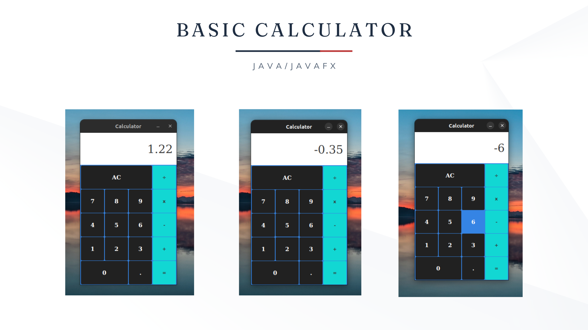
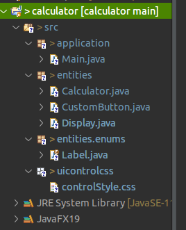
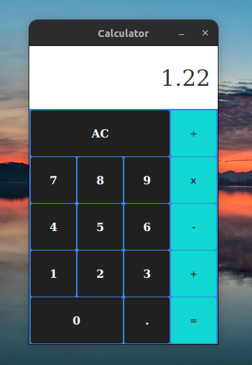
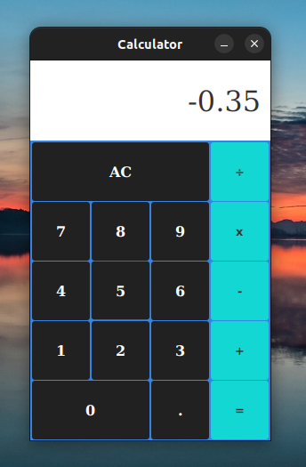
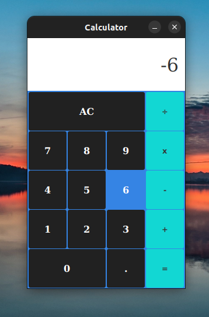

# Basic calculator with Java

- Simulating mac calculator
- Project video: [link](https://youtu.be/axinO0j9SkI)



## Installation

1. Clone this repository:
```sh
git clone https://github.com/pauloh-alc/basic-calculator.git
```

2. Run the code in some IDE. You will need JavaFX, prefer JavaFX 11+. Make your settings too. Follow the link below with the step by step.

- Getting Started with JavaFX: [link](https://openjfx.io/openjfx-docs/)



## Code working





## License

[MIT](https://github.com/pauloh-alc/basic-calculator/blob/main/LICENSE)

## Author

Paulo Alencar: [linkedin](https://www.linkedin.com/in/paulo-alencar-006357225/)
